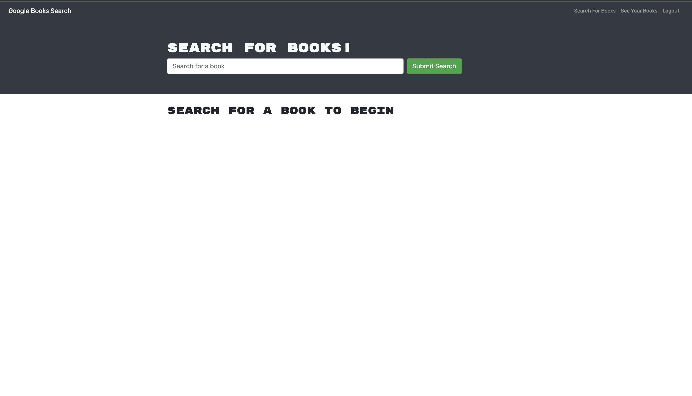

# Book-Search-Engine

## Table Of Contents

* [Description](#description)
* [Deployed](#deployed)
* [Usage](#usage)
* [Contribute](#contribute)
* [Take A Look](#take-a-look)
* [Questions](#questions)
## Description
The Book search engine is an application is leveraging the entire MERN stack and with a React front end, MongoDB database, and Node.js/Express.js server and API. It's set up to allow users to save book searches to the back end. The application is built using Google Books API search engine build with GraphQL API and Apollo Server.

This project was bootstrapped with Create React App.

## Heroku Deployed

For Deployed App click [here!](https://booksengine.herokuapp.com/)

Or 

You can watch video [here!]()

## Usage

GIVEN a book search engine
WHEN I load the search engine
THEN I am presented with a menu with the options Search for Books and Login/Signup and an input field to search for books and a submit button
WHEN I click on the Search for Books menu option
THEN I am presented with an input field to search for books and a submit button
WHEN I am not logged in and enter a search term in the input field and click the submit button
THEN I am presented with several search results, each featuring a book’s title, author, description, image, and a link to that book on the Google Books site
WHEN I click on the Login/Signup menu option

## Take A Look

## Questions

For more content, check out my [GitHub](https://github.com/mffonua)!

Any questions regarding this project can be sent to myles.fonua@gmail.com
